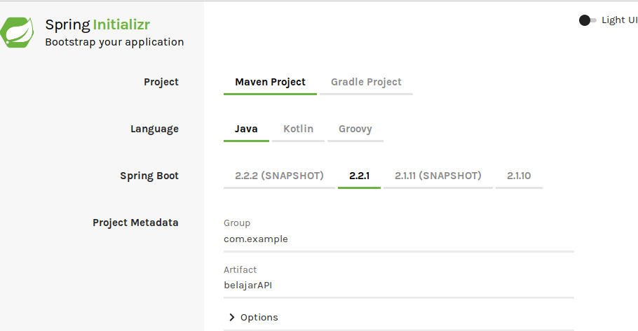
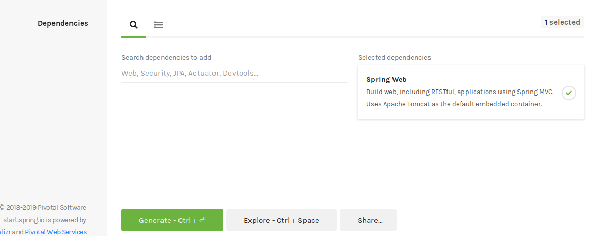
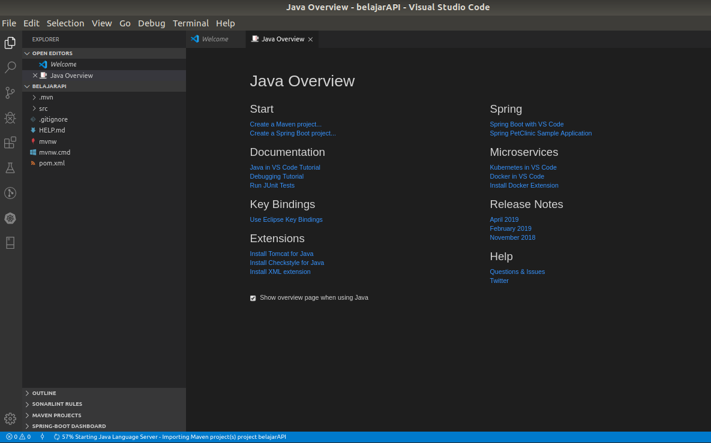
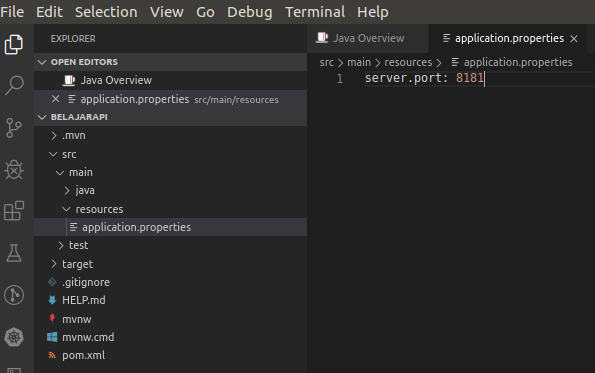
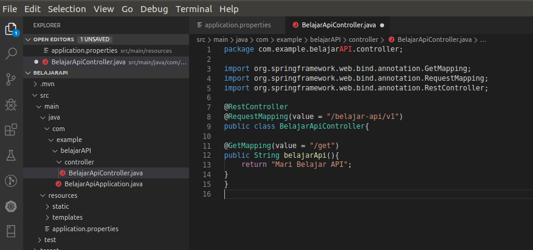
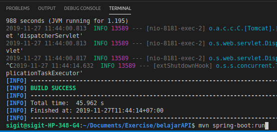
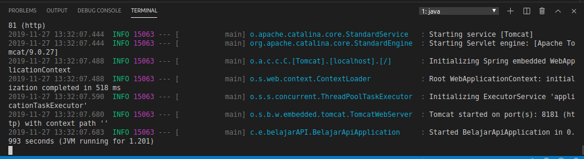
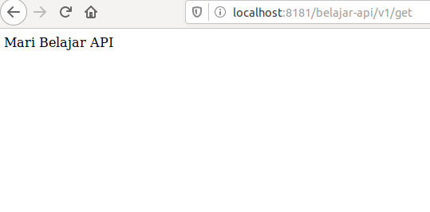

## Membuat REST API Sederhana dengan Java Spring Boot

    Pada tutorial kali ini akan saya jelaskan secara singkat bagaimana membuat API (Application Program Interface) sederhana menggunakan Java Spring Boot.

#### 1. Persiapan 
    Sebelum mengikuti tutorial ini pastikan beberapa hal ini sudah terinstal di server lokal kamu.
   - Java
   - Maven
   - IDE (Intellij, VSCode, STS, dll)

#### 2. Spring Initializr 
    Untuk memulai project kamu bisa kunjungi https://start.spring.io/
   - Pilih Maven Project untuk build toolnya
   - Pilih Java untuk bahasa pemrogramannya
   - Ubah nama artifact sesuai keinginanmu, misalkan dalam project ini saya namakan belajarAPI 
   - Untuk project sederhana ini tambahkan dependencies Spring Web 
   - Generate Project, lalu download artifact yang sudah tergenerate

   - Untuk project sederhana ini tambahkan dependencies Spring Web 
   - Generate Project, lalu download artifact yang sudah tergenerate

#### 3. Memulai project
    Setelah berhasil didownload, extract dokumen tersebut kemudian buka dengan IDE anda. Dalam tutorial kali ini saya menggunakan Visual Studio Code untuk membuka project belajarAPI.

#### 4. Setting Environment di application.properties
    Kita dapat mengatur konfigurasi project kita melalui application.properties yang dapat kita temukan dalam folder src→ main → resources. Untuk project kali ini kita cukup mengatur server port kita saja ke port 8181, anda bisa menggunakan port yang lain secara bebas selama tidak dipakai  oleh aplikasi lain yang sedang running.

#### 5. Membuat Controller
    Langkah selanjutnya kita akan membuat controller sederhana untuk menempatkan end point API yang akan kita buat. Adapun API yang akan kita buat adalah API sederhana yang akan mereturn “Mari Belajar API” ketika dihit dengan metode GET.
   - Buat package/folder controller di dalam package belajarAPI
   - Buat class baru dengan nama BelajarApiController.java

#### 6. Membuat API
   - Tambahkan anotasi @RestController untuk menjadikan class java kita sebagai Rest Controller.
   - Tambahkan anotasi @RequestMapping lalu masukkan value berupa end point yang akan kita jadikan API kita. Dalam tutorial ini saya membuat API dengan url end point localhost:8181/belajar-apiv1/get .
   - Tambahkan anotasi @GetMapping untuk membuat API dengan GET method. Untuk method POST dapat menggunakan @PostMapping. Tambahkan value untuk mengkhususkan API yang kita buat agar memiliki end point yang kita harapkan.
   - Dalam API sederhana ini kita berikan return value String dengan pesan “Mari Belajar API”.

#### 7. Menjalankan program
    Untuk menjalankan program jalankan comman mvn spring-boot:run pada direktori project anda melalui terminal.

    Apabila berhasil running akan muncul tampilan seperti ini

#### 8. Menguji coba API
    Untuk mencoba API yang sudah kita buat anda bisa menggunakan Postman, atau untuk case kita kali ini karena hanya berupa GET API kita bisa langsung menggunakan browser kita dengan mengetikkan alamat end point API yang sudah kita buat yakni localhost:8181/belajar-api/v1/get dan akan mengembalikan pesan “Mari Belajar API”. Selamat mencoba!

